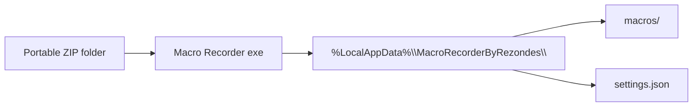
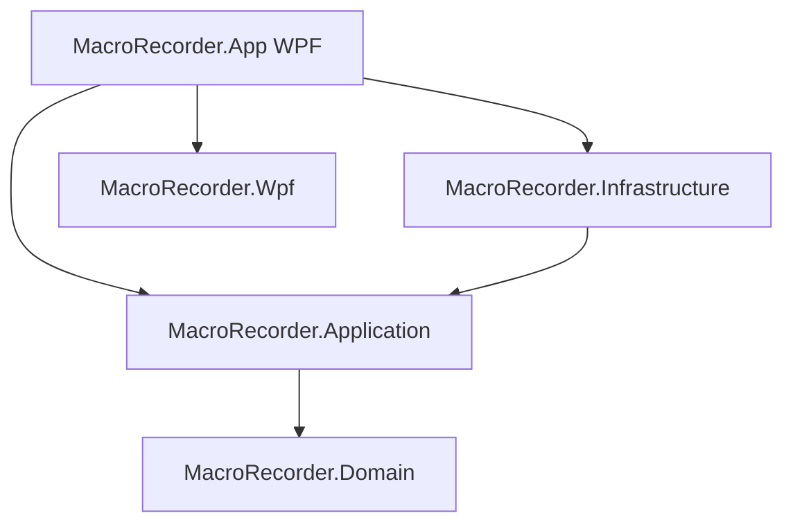

# Macro Recorder by Rezondes

Windows desktop app to record, edit, and replay keyboard and mouse macros — including window focus detection and macro queues.

**Requirements:** Windows 10/11, **64-bit only**. The portable build is self-contained (no separate .NET install).

**Downloads:** [GitHub Releases](https://github.com/Rezondes/MacroRecorder/releases) — asset `MacroRecorder-portable-win-x64-<version>.zip`

---

## For users

### Getting started

1. **Download** the latest portable ZIP from [GitHub Releases](https://github.com/Rezondes/MacroRecorder/releases).
2. **Choose a folder** — e.g. `D:\Apps\MacroRecorder\`. Any writable path works; Program Files is not required.
3. **Extract** the ZIP completely. Keep all files in one folder (the .NET runtime is included).
4. **Run** `Macro Recorder by Rezondes.exe`.
5. **Optional:** Pin a shortcut to the EXE or taskbar.

Your macros and settings are **not** stored inside the portable folder. They live in:

`%LocalAppData%\MacroRecorderByRezondes\`

That means you can move or replace the app folder when updating without losing data.



### Updating

1. Open **Settings** (gear icon) → **General** tab.
2. Use **Check for updates now**, or rely on the startup check (enabled by default).
3. If an update is available, the app opens the GitHub release page in your browser.
4. Download the new ZIP, **close the app**, and extract over your existing folder (or into the same path).
5. Start the app again. Macros, settings, and hotkeys in `%LocalAppData%` are unchanged.

### First-run tips

- **Language:** Settings → General → choose **Deutsch** or **English**, then **Save**.
- **Updates:** You can disable “Check for updates on startup” in the same tab.

---

## Features by area

The app uses a single main window. Use the header buttons and back navigation to switch between areas.

### Overview (home)

Your macro library at a glance.

- **Play** a macro from the list.
- **Edit** opens the macro editor.
- **Delete** with confirmation.
- **Drag and drop** rows to reorder (order is saved).
- **Global playback hotkey** per macro (⋯ menu): assign, change, or remove a system-wide shortcut while the app is running.
- **Import macro (JSON)** from the toolbar — paste JSON or pick a file.
- **Macro queue creator** — open the queue builder from the toolbar.

### Record new macro

Quick path to capture a new macro without opening the editor first.

- Records keyboard, mouse, and **window focus changes**.
- Flow: **Start** → perform actions → **Stop** → enter a name.
- Optionally **open in editor** after saving.

### Macro editor

Full timeline editor for one macro.

- **Timeline** of actions (keys, mouse, waits, focus changes, grouped mouse moves).
- **Undo / redo** (Ctrl+Z / Ctrl+Y).
- **Selection:** move up/down, duplicate, delete; drag rows to reorder.
- **Insert step:** delay, mouse click, or key press (before/after selection).
- **Record** additional steps into the open macro.
- **Play test** — run the macro once from the editor.
- **Rename**, **Save**, **Share JSON** (view/copy/export).
- **Focus-bound mouse positions** — after a focus-change row, mouse coordinates are relative to the foreground window until focus is lost (see tooltip in editor).
- **Record mouse movements** toggle and minimum move distance (also in Settings → Macro).
- **Edit row** — change values for a single event (including focus reference size and ±px tolerance).

### Macro queue

Chain multiple macros into an automated run.

- Add steps from your macro library; set **repeat count** per step.
- Delays: initial, between repeats, after each step (hours:minutes:seconds).
- **Loop entire queue** until stopped.
- **Save / load** queue as JSON.
- **Run**, **Pause**, **Resume**, **Stop** with a one-pass timeline preview.

### Settings

| Tab | What you can configure |
|-----|------------------------|
| **General** | UI language (DE/EN); current version; check for updates on startup; manual update check |
| **Visuals** | Light or dark mode; color theme (Blue grey, Indigo, Teal, Deep purple, Amber) |
| **Macro** | Minimum pixel distance between recorded mouse moves; playback start delay after clicking Play (ms); on focus change during playback — bring target window to foreground, restore if minimized |

Click **Save** to apply. Unsaved changes prompt when leaving settings or switching tabs.

### Playback behavior

- A **status overlay** appears during playback (estimated time, cancel button).
- **Do not use keyboard or mouse** during playback — real input **stops** the run and shows a notice.
- Optional **start delay** after clicking Play (Settings → Macro).
- **Focus-bound macros:** before play, the app checks that the recorded target window exists and (when recorded) that client size matches within configured tolerance.

---

## For developers

### Stack and layout

| Project | Role |
|---------|------|
| `MacroRecorder.Domain` | Models (`Macro`, `RecordedInputEvent` hierarchy, queue documents) — no UI/platform |
| `MacroRecorder.Application` | Orchestration, ports (`IPlaybackService`, `IRecordingEngine`, …), timeline logic |
| `MacroRecorder.Infrastructure` | WinAPI hooks, `SendInput` playback, JSON persistence, GitHub update check |
| `MacroRecorder.App` | WPF shell, ViewModels, views, DI composition root |
| `MacroRecorder.Wpf` | Shared themes and controls (e.g. `DigitsOnlyNumericBox`) |

Architecture: DDD-style layers; MVVM in the App project; ports in Application, implementations in Infrastructure.



### Prerequisites

- [.NET 10 SDK](https://dotnet.microsoft.com/download)
- Windows (x64) for build and run

### Build and run locally

```powershell
dotnet build MacroRecorderByRezondes.sln
dotnet run --project MacroRecorder.App/MacroRecorder.App.csproj
```

### Portable release build

```powershell
.\scripts\build-portable.ps1
```

Output: `artifacts/portable/MacroRecorder-portable-win-x64-<Version>.zip`

### Publishing a release

1. Bump `<Version>` in `MacroRecorder.App/MacroRecorder.App.csproj`.
2. Commit and push.
3. Create and push a tag that matches the version, e.g. `v0.0.3` for version `0.0.3`.
4. GitHub Actions ([`.github/workflows/release.yml`](.github/workflows/release.yml)) verifies tag ↔ csproj, builds the ZIP, and publishes the release.

### Localization

- **Source of truth:** [`scripts/build_ui_resx.py`](scripts/build_ui_resx.py) (`EN` and `DE` dictionaries).
- After editing strings: `python scripts/build_ui_resx.py`
- Do **not** hand-edit `MacroRecorder.App/Localization/UiStrings.resx` or `UiStrings.de.resx` (they are generated).

### Conventions

Project rules live in [`.cursor/rules/`](.cursor/rules/) (`macro-recorder-conventions.mdc`, `macro-recorder-localization.mdc`, `macro-recorder-git-commit.mdc`). Commits follow [Karma Runner](https://karma-runner.github.io/6.4/dev/git-commit-msg.html) format.

Compressed architecture notes for agents: [`.cursor/map/project-map.md`](.cursor/map/project-map.md).

### Runtime data (debugging)

| Path | Content |
|------|---------|
| `%LocalAppData%\MacroRecorderByRezondes\settings.json` | UI language, theme, macro/playback prefs, update prefs |
| `%LocalAppData%\MacroRecorderByRezondes\macros\` | Saved macro JSON files |
| Same folder (other files) | Playback hotkey assignments, queue documents |
